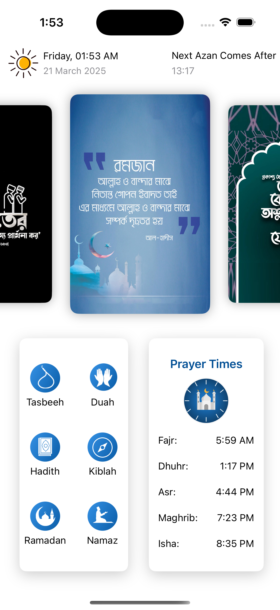
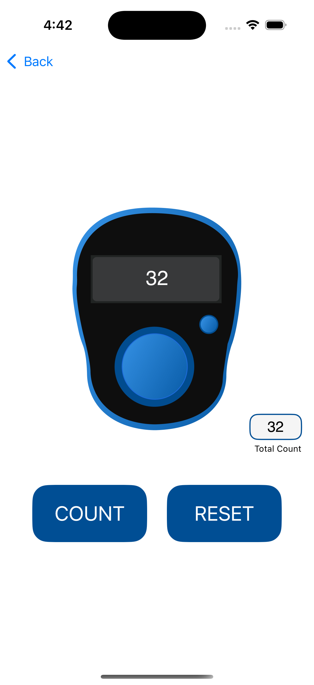

# Prayer Time

Prayer Time is an iOS application that provides accurate prayer times based on the user's location. The app utilizes a free API to fetch prayer timings and ensures a smooth user experience with a clean and intuitive interface.

## Features
- Accurate **prayer times** based on **location**  
- Simple and **user-friendly interface**  

## Tech Stack
- **Language:** Swift  
- **Frameworks:** SwiftUI, Combine  
- **API Used:** (https://aladhan.com)  
- **State Management:** Combine  

## Screenshots  
  

